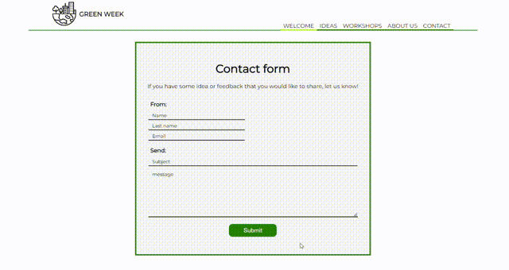
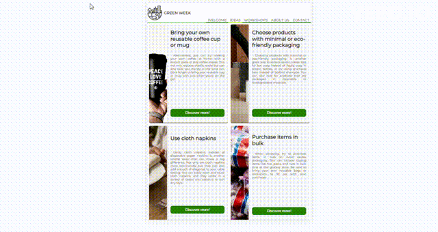
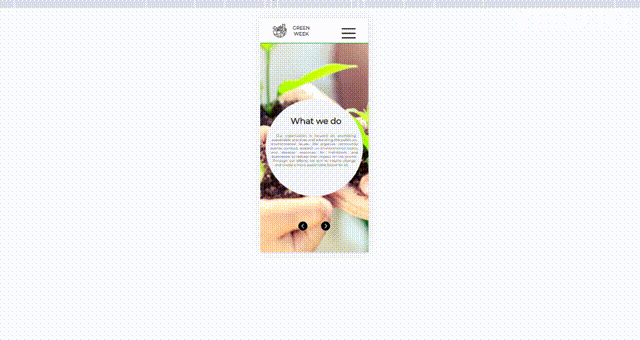

# GREEN WEEK


## Project aim

Our primary objective for developing this application was to raise awareness about environmental sustainability and provide practical ideas on how to reduce plastic consumption in our day-to-day activities. Our goal was to develop an application that provides variety of interactive features that would engage users and encourage them to explore the app further. To achieve this, we focused on developing a user-friendly design that is well-balanced in terms of functionality and aesthetics. Overall, our aim was to create an application that not only delivers valuable content but also provides them with a pleasant and memorable experience.

## Table of contents

- [Team](#team)
- [To do](#to-do)
- [Features](#features)
- [Project status](#project-status)
- [Technologies](#technologies)
- [Setup](#setup)
- [Sources](#sources)

## Team

Mentors: Katarzyna Mrawczyńska, Adrian Widlak, Łukasz Dutka

- [Magdalena Huget](https://github.com/magdalenahuget)
- [Wiktoria Kulczyńska](https://github.com/wiktoria75)
- [Marcin Lewiński](https://github.com/marcinlewinski)
- [Patrycja Markiewicz](https://github.com/patrycjavmarkiewicz)

## To do

- Explore ideas and discover ways to reduce plastic waste
- Connect with other organizations and individuals who share our passion for sustainability
- Sign up for workshops to learn more about reducing plastic waste
- Share your feedback and new ideas for reducing plastic waste

## Features

### Form validation



### Pop-ups



### Responsiveness



## Project status

This project is considered complete and stable, and all planned features have been implemented. While we will address any critical issues that arise, we do not plan to add any new features or accept pull requests.

Thank you for your interest in this project. We hope that you find it useful. Please feel free to fork this repository and use it as a starting point for your own project, or to learn from the code.

## Technologies

Project is created with:

- Nodejs version: 18.14.2
- React
- Java Script
- CSS
- HTML
- Visual Studio Code

## Setup

To run this project, install it locally using npm:

```
$ cd ../react-for-a-cause-react-marcinlewinski
$ npm install
$ npm start
```

## Sources

- [https://www.pexels.com/](https://www.pexels.com/)
- [https://www.childandfamily.foundation/sites/default/files/styles/banner_4_1/public/article/banner/DSCN1041.JPG?h=c67361d1&itok=vnupCOyt](https://www.childandfamily.foundation/sites/default/files/styles/banner_4_1/public/article/banner/DSCN1041.JPG?h=c67361d1&itok=vnupCOyt)
- [https://media.cnn.com/api/v1/images/stellar/prod/220729124818-composting-benefits-stock.jpg?c=16x9&q=h_720,w_1280,c_fill](https://media.cnn.com/api/v1/images/stellar/prod/220729124818-composting-benefits-stock.jpg?c=16x9&q=h_720,w_1280,c_fill)
- [https://www.biologie.uni-wuerzburg.de/fileadmin/_processed_/0/1/csm_1507-biocenter-img-5_8109c3d260.jpg](https://www.biologie.uni-wuerzburg.de/fileadmin/_processed_/0/1/csm_1507-biocenter-img-5_8109c3d260.jpg)
- [https://tyonote.com/wp-content/uploads/2021/02/a_group-1024x682.jpg](https://tyonote.com/wp-content/uploads/2021/02/a_group-1024x682.jpg)
- [https://study.com/cimages/course-image/plants-ecology-lesson-plans_522149_large.jpeg](https://study.com/cimages/course-image/plants-ecology-lesson-plans_522149_large.jpeg)
- [https://www.projecttimes.com/wp-content/themes/yootheme/cache/a0c2a640e1085a57e07c368bfe5151f0-f071cec3.jpeg](https://www.projecttimes.com/wp-content/themes/yootheme/cache/a0c2a640e1085a57e07c368bfe5151f0-f071cec3.jpeg)
- [https://www.freepik.com/?\_gl=1*1hh0e19*test_ga*MTEzOTA1ODI1Mi4xNjc1MzcxNTY3*test_ga_523JXC6VL7*MTY3Nzc2MTkwOC4xMS4xLjE2Nzc3NjE5NjEuNy4wLjA.*fp_ga*MTEzOTA1ODI1Mi4xNjc1MzcxNTY3*fp_ga_1ZY8468CQB\*MTY3Nzc2MTkwOC4xMS4xLjE2Nzc3NjE5NjEuNy4wLjA.](https://www.freepik.com/?_gl=1*1hh0e19*test_ga*MTEzOTA1ODI1Mi4xNjc1MzcxNTY3*test_ga_523JXC6VL7*MTY3Nzc2MTkwOC4xMS4xLjE2Nzc3NjE5NjEuNy4wLjA.*fp_ga*MTEzOTA1ODI1Mi4xNjc1MzcxNTY3*fp_ga_1ZY8468CQB*MTY3Nzc2MTkwOC4xMS4xLjE2Nzc3NjE5NjEuNy4wLjA.)
- [https://www.flaticon.com/authors/tulpahn](https://www.flaticon.com/authors/tulpahn)
- [https://www.flaticon.com/authors/ilham-fitrotul-hayat](https://www.flaticon.com/authors/ilham-fitrotul-hayat)
- [https://www.flaticon.com/authors/pixel-perfect](https://www.flaticon.com/authors/pixel-perfect)
